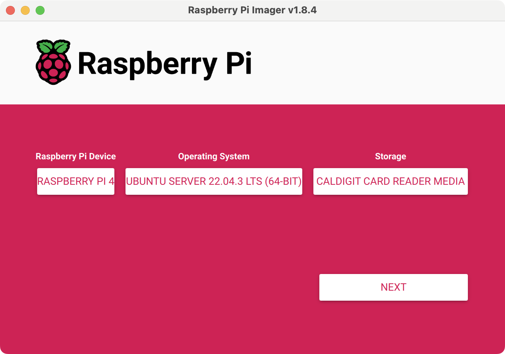
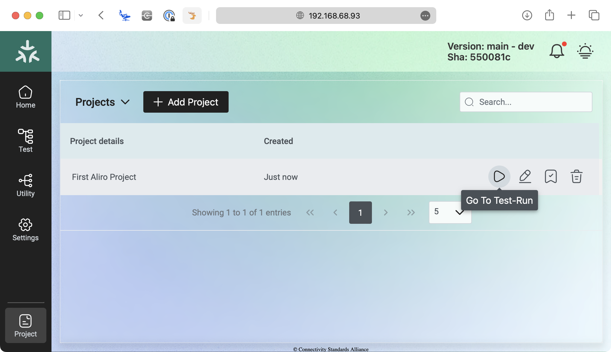
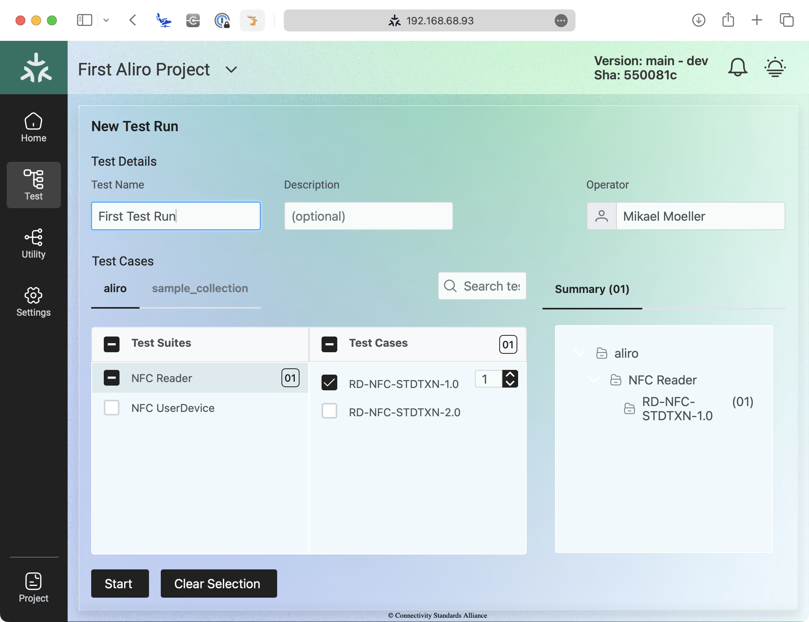
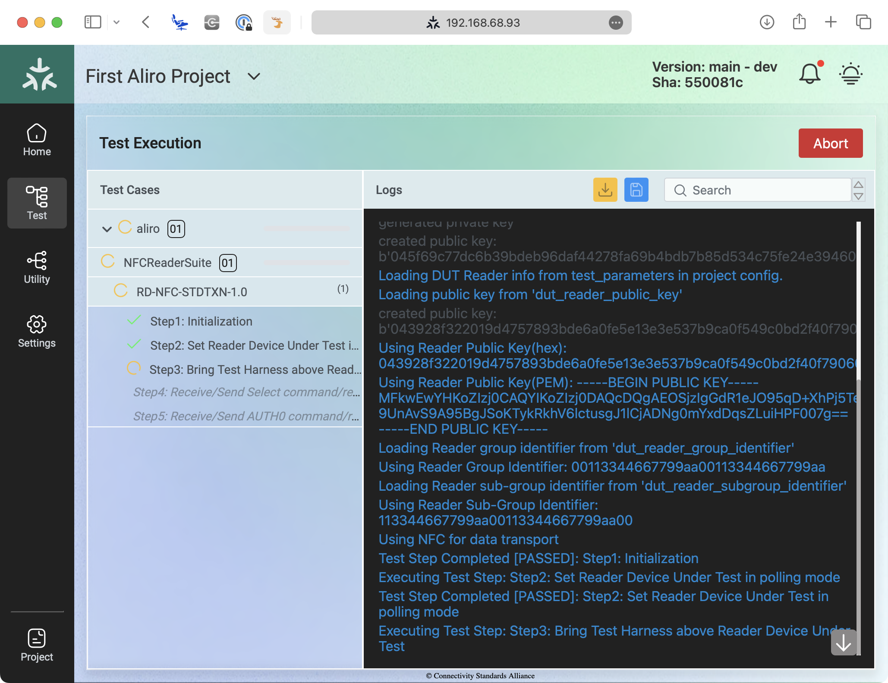

# Aliro Certification Tool
A test harness and tooling designed to simplify development, testing, and certification for devices, guided by the Connectivity Standards Alliance - ACWG.


> [!NOTE]
> The tool is a complete reuse from CSA - Matter, and UI is still showing a number of unrelated Matter information. This will be fixed eventually.

This version of the Aliro Certification Tool uses:
* Aliro Specification Version 0.7.5
* ACWG CSG Test Plan Version 0.7.5.1a_r2

# Setup Instructions
Following this section should take a couple hours, mostly depending on internet speed.

## Requirements
* Computer with SD-reader
* Raspberry pi 4 Model B - 8GB preferred (4GB might work)
    * power adapter for raspberry pi
    * micro SD card (16 GB or more)
* OM27160B1EVK (NFC interface)
* Ethernet network cable (UDP cable) (optional)
* LAN/Wi-Fi Network with internet access
* Murata LBUA0VG2BP-EVK-P (BLE/UWB interface)
* Micro USB male to USB A male cable (for connecting the Murata)

> [!TIP] 
> It is possible to setup the TH entirely over SSH. Alternatively, access the Raspberry Pi directly using:
> * micro HDMI to HDMI cable
> * pc monitor
> * usb keyboard

> [!IMPORTANT]
> See https://github.com/csa-access-control/aliro-actuator/tree/27-add-uwb-support/third_party for instructions on updating the murata FW. 


## A - Installing Ubuntu on SD-Card

1. Download and run Raspberry Pi Imager on you computer. 
    * Available at https://www.raspberrypi.com/software/
2. CHOOSE DEVICE under "Raspberry Pi Device" 
    * Select "Raspberry Pi 4"
3. CHOOSE OS under "Operating System"
    1. Select "Other general-purpose OS"
    2. Select "Ubuntu" 
    3. Select "Ubuntu Server 22.04.3 LTS (64-bit)" or "Ubuntu Server 22.04.4 LTS (64-bit)"

> [!IMPORTANT]
> You must pick exactly "Ubuntu Server 22.04.3 LTS (64-bit)" or "Ubuntu Server 22.04.4 LTS (64-bit)"

4. CHOOSE STORAGE under "Storage"
    * Insert the micro sd card, and select in the list.
5. NEXT



6. EDIT SETTINGS under "Would you like to apply OS customisation settings?"
    * Under GENERAL Tab:
        * Set hostname. Must be unique per TH setup. Eg. `aliro-th-pi1`.local
        * Set username and password
        * *Optionally configure Wi-Fi if not using an ethernet cable.* (Only password protected Wi-Fi is supported)
    * Under SERVICES Tab:
        * "Enable SSH" and choose "Use password Authentication"


7. SAVE on "OS Customisation" modal
8. YES on "Would you like to apply OS customisation settings?"
9.  Continue to write Ubuntu OS to micro SD-card
10. Wait for writing and verification of SD-card to complete.


## B - Assembling Raspberry Pi

> [!TIP] 
> Start this with the Raspberry Pi disconnected from power.

1. Attach OM27160B1EVK to Raspberry Pi
2. Connect the Murata LBUA0VG2BP-EVK-P to the Raspberry Pi using the micro usb cable.
3. Insert micro SD-card
4. [Optional] Attach ethernet cable
5. [Optional] Connect monitor and keyboard
6. Power on raspberry Pi

## C - Connecting to Raspberry Pi
There's a couple different ways you can connect to the Raspberry Pi,

### Connecting via SSH using hostname
> [!NOTE] 
> Hostname access might not be supported on all computers and networks, if this fails, please try using IP address directly. See below.
1. Wait for Raspberry Pi to boot
2. Connect from terminal on PC via ssh using username and hostname `ssh <username>@<hostname>.local`.
    
    Example:
    ```
    ssh ubuntu@aliro-th-pi1.local
    ```

3. Enter password when prompted

### Connecting via SSH using IP Address
1. Wait for Raspberry Pi to boot
2. Connect from terminal on PC via ssh using username and hostname `ssh <username>@<hostname>.local`.
    
    Example:
    ```
    ssh ubuntu@<ip-address>
    ```

3. Enter password when prompted
   
> [!TIP] 
> If you don't know the IP address you can discover it from another machine on the LAN:
> - On Linux and macOS (might require `net-tools` installed)
>     ```
>     arp -na | grep -i  "b8:27:eb\|dc:a6:32\|e4:5f:01"
>     ```
> - On Windows:
>     ```
>     arp -a | findstr b8-27-eb dc-a6-32 e4-5f-01

### Connecting using Monitor and Keyboard

This is mostly a backup, if you need to configure network or find IP address.

1. Simply login with the chosen username and password. 

> [!TIP] 
> Default credentials are username: `ubuntu` and password: `ubuntu`.

## D - Installing Aliro Test Harness on Raspberry Pi

1. Create an SSH key-pair to access GitHub Repository
    
    ```sh
    ssh-keygen -t ed25519 -C "<your github email>"
    ``` 
    
> [!NOTE] 
> Default file location, no passphrase required, just press enter

2. Copy public ssh key

    ```sh
    cat /home/ubuntu/.ssh/id_ed25519.pub
    ```

3. Add SSH Key to your account on GitHub 
   
   * https://github.com/settings/ssh/new
   * Alternatively, click profile picture, then settings, then "ssh and GPG keys" and finally "new ssh key".
   
4. Get Aliro Certification Tool code from GitHub

    * Clone repository in home directory
        ```sh
        cd ~
        git clone git@github.com:csa-access-control/aliro-certification-tool.git
        ```

        * When asked if you trust the connection, please type `yes` and hit enter.

> [!TIP]
> You can check out a specific release. Eg. `release/test_event3-2024-aliro_specification_v0.7.4-v1.1`
> 
>   ```sh
>   cd  ~/aliro-certification-tool  
>   git checkout release/test_event3-2024-aliro_specification_v0.7.4-v1.1  
>   ```

6. Auto install Aliro Certification tool    
   * Run auto installer script
    
        ```sh
        cd  ~/aliro-certification-tool
        ./scripts/pi-setup/auto-install.sh
        ```

        * When prompted by `[sudo]` for user password, please type in password and hit enter.
   * When completed, script will prompt you to restart.
     * Type `1`  and press enter to reboot raspberry Pi.
  
> [!NOTE] 
> The auto installer is mostly hand-off, but can take more than an hour depending on you internet connection.

> [!NOTE] 
> First reboot after the auto installer might take 5 minutes or more, as several updates are applied.

## E - Starting the Aliro Test Harness on Raspberry Pi
1. Initialize the submodules 

    ```sh
    cd  ~/aliro-certification-tool
    git submodule update --init --recursive
    ```

2. Setup the Test Harness

    ```sh
    cd  ~/aliro-certification-tool/test_collections/aliro
    ./setup.sh
    ```

3. Start the Test Harness

    ```sh
    cd  ~/aliro-certification-tool
    ./scripts/start.sh
    ```

# Usage Instructions

> [!NOTE] 
> The Test Harness will start automatically upon booting the Raspberry Pi.

## A - Opening the GUI
The UI of the tool is accessed via a Web Browser from a computer on the same LAN.

In a browser, set as address: `http://<raspberry-pi-ip-address>`

For example: http://192.168.2.9


> [!TIP]
> You need to wait a couple minutes after booting the Raspberry Pi, before attempting to connect.

> [!TIP]
> You can view the IP address of the Raspberry Pi by running
> `hostname -I` in a terminal on the Raspberry Pi.

## B - Configuring a Test Project

1. Start by clicking "Create Project"
2. Give the Project a name
3. Configure Parameters
    * Click "Edit"
    * In the JSON, locate the `test_parameters` section.
    * It will be set to `null` by default.
    * Set the test parameters as needed for you testing.

        Example:
        ```json
        "test_parameters": {
            "dut_reader_public_key":"043928f322019d4757893bde6a0fe5e13e3e537b9ca0f549c0bd2f40f79060252a0a4f291192157a95cb6eb202759428c00cd834998c5d0eab192ee8873c5d34ee",
            "dut_reader_group_identifier":"00113344667799AA00113344667799AA",
            "dut_reader_group_sub_identifier":"113344667799AA00113344667799AA00",
            "dut_reader_group_resolving_key":"00000000000000000000000000000000"
        }
        ```
        Full description of [Test Parameters](#test-parameters) in a section later.

        

    * Click "Update" to save configuration change
    * Click "Create"


## C - Creating a Test Run (Running test scripts)

1. Click the '▶️' button ("Go To Test-Run") button next to the project.

    

2. Click "Create new Test Run"

    

3. Select "Operator Name" in the top right corner.
   - Must be created on first use.
4. Select Test Suite or Test Cases. Multiple test cases can be selected.
5. Click "Start"

    
  
# Test Parameters

You can edit test parameters for a Project during project creation, but you can also click the "Edit" Pencil icon on the row of the Project later.

## Test Parameters for Reader Tests

* `dut_reader_public_key` Public key for the Reader DUT. 
  * Supported Format: 
    * DER encoded HEX string
    * PEM string (including `\n` as for line breaks)
* `dut_reader_group_identifier` Group Identifier for Reader DUT.
  * Supported Format: 
    * HEX string
* `dut_reader_group_sub_identifier` Sub-group Identifier for Reader DUT.
  * Supported Format: 
    * HEX string
* `dut_reader_group_resolving_key` Group resolving key, used for the BLE tests, during 
the dynamic tag generation.
  * Supported Format: 
    * HEX string
* `th_access_credential_private_key` Private key for the user access credential, 
simulated by the tool. 
  * Supported Format:
    * DER encoded HEX string
    * PEM string (including `\n` as for line breaks)
* `th_access_credential_public_key` Public key for the User access credential, 
simulated by the tool.  
  * Supported Format:
    * DER encoded HEX string
    * PEM string (including `\n` as for line breaks)
* `dut_reader_issuer_public_key` Reader System Issuer CA certificate public key, used 
for certificate verification.  
  * Supported Format: 
    * DER encoded HEX string
    * PEM string (including `\n` as for line breaks)

## Test Parameters for User Device Tests

> [!NOTE] 
> Private and Public keys must match, and either none of both parameters should be set.

* `th_reader_private_key` Private key for the Reader, simulated by the tool. 
  * Supported Format: 
    * DER encoded HEX string (138 or 32 bytes)
    * PEM string (including `\n` as for line breaks)
* `th_reader_public_key` Public key for the Reader, simulated by the tool. 
  * Supported Format: 
    * DER encoded HEX string
    * PEM string (including `\n` as for line breaks)
* `th_reader_group_identifier` Group Identifier for the Reader, simulated by the tool.
  * Supported Format: 
    * HEX string
* `th_reader_sub_group_identifier` Sub-group Identifier for the Reader, simulated by the tool.
  * Supported Format: 
    * HEX string
* `th_reader_certificate` Reader Certificate for the Reader, simulated by the tool. 
Used for LOAD CERT and AUTH1 command.
  * Supported Format: 
    * HEX string
* `th_reader_certificate` certificate to send during LOAD_CERT and AUTH1 commands.
  * Supported Format: 
    * HEX string
* `th_reader_group_resolving_key` Group resolving key, used for the BLE tests, during 
the dynamic tag generation.
  * Supported Format: 
    * HEX string
* `th_reader_spsm` spsm (Simplified Protocol / Service Multiplexer), used for the BLE 
tests, in the 'Reader SPSM and AC BLE UWB Protocol Version Characteristic Value 
declaration'.
  * Supported Format: 
    * HEX string
* `th_endpoint_public_key` Endpoint public key, for the key slot lookup table used byb the tool. 
  * Supported Format: 
    * DER encoded HEX string
    * PEM string (including `\n` as for line breaks)

# Updating the Tool

Whenever there's an update to the tool, it can simply be updated by running these steps on the Raspberry Pi.

1. Check out the version of the tool you're updating to, eg. `release/test_event1-2024`

    ```sh
    cd  ~/aliro-certification-tool
    git fetch
    git checkout release/test_event1-2024 
    ```

2. Run the update script:

    ```sh
    cd  ~/aliro-certification-tool
    ./scripts/update.sh
    ```
## Other Helpful commands

Test Harness will be started automatically when booting up the Raspberry Pi.

To **manually stop** TH run the command below in `aliro-certification-tool` folder 
```sh
./scripts/stop.sh
```

To **manually start** TH run the command below in `aliro-certification-tool` folder 
```sh
./scripts/start.sh
```

To **access logs** from TH run the command below in `aliro-certification-tool` folder 
```sh
docker compose logs
```

Autostart on bootup can be disabled using
```sh
systemctl disable aliro-th
```

#### Configuring Raspberry Pi to connect to a Wi-Fi without password
Perform the following steps on the Raspberry Pi.

1. In `/etc/netplan/50-cloud-init.yaml`, add under `network`:
    ```yaml
        wifis:
            wlan0:
                dhcp4: true
                optional: true
                access-points:
                    "<network_name>": {}
    ```
2. Apply changes and reboot 
    ```
    sudo netplan apply
    sudo reboot
    ```

## Authoring Test Scripts

Aliro test scripts are located in `test_collections/aliro`. They must be located as the same file structure as the current `sample_collection` with `SampleSuite` and `SampleTestCase`. This ensures, that the Test Harness can automatically discover the tests on launch.

After changing/adding test scripts, the test harness backend must be restarted. This can be done using this command:

```sh
docker restart aliro-certification-tool_backend_1
```

Test Harness backend logs can be streamed using this command:
```sh
docker restart aliro-certification-tool_backend_1
```
