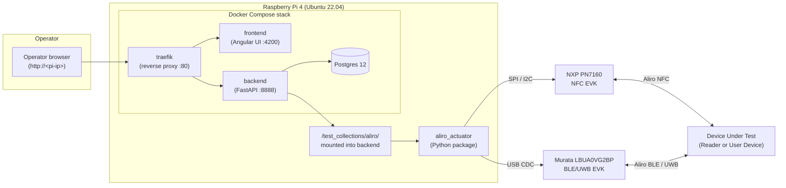
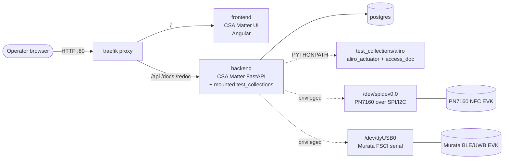
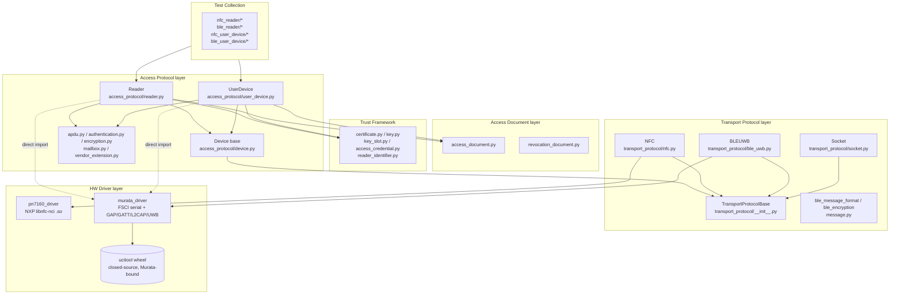
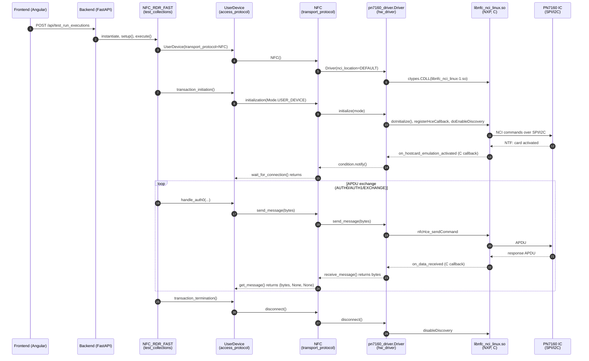

# Aliro Test Harness — Architecture

## 1. Purpose and Scope

This document describes the architecture of the Aliro Certification Tool — a
fork of the CSA Matter Test Harness repurposed to test devices against the
Aliro specification (digital keys for physical access control, over NFC, BLE,
and UWB). It covers the deployment stack, the layering of the Aliro actuator,
the test-collection layout, the runtime data flow of a test, and how the
harness integrates with its hardware front ends.

The harness drives two pieces of hardware:

- **NFC**: NXP PN7160 evaluation kits (`OM27160A1EVK` / `OM27160B1EVK`),
  via NXP's `linux_libnfc-nci` userspace library, wrapped by
  `aliro_actuator.hw_driver.pn7160_driver`.
- **BLE / UWB**: Murata `LBUA0VG2BP-EVK-P`, driven via the FSCI serial
  protocol by `aliro_actuator.hw_driver.murata_driver`, and a bundled
  `ucitool` Python wheel for UWB control.

The upstream CSA Matter backend image
(`ghcr.io/project-chip/csa-certification-tool-backend:4e99d78`,
`docker-compose.yml:71`) is consumed as-is and pinned; all Aliro-specific
code lives in the mounted `test_collections/` tree.

---

## 2. Current Architecture

### 2.1 Top-level deployment

At the highest level, an operator drives a Docker stack on the Raspberry
Pi from a browser on the same LAN, and the Pi's two radio front ends face
the DUT:



In deployment terms, the tool is a four-container Docker Compose stack
(`docker-compose.yml:15-119`):

| Service     | Image                                                           | Role                                                                                            |
| ----------- | --------------------------------------------------------------- | ----------------------------------------------------------------------------------------------- |
| `proxy`     | `traefik:v2.2`                                                  | Reverse proxy, exposes `:80` for UI and `:8090` for dashboard.                                  |
| `frontend`  | `ghcr.io/project-chip/csa-certification-tool-frontend:980df53`  | Upstream CSA Matter Angular UI (still shows Matter branding, per `USER_MANUAL.md` §1).          |
| `backend`   | `ghcr.io/project-chip/csa-certification-tool-backend:4e99d78`   | Upstream CSA Matter FastAPI test runner. Test code is **mounted in**, not baked into the image. |
| `db`        | `postgres:12`                                                   | Test-result persistence.                                                                        |

The decisive lines are at `docker-compose.yml:74-90`:

```yaml
volumes:
  - ./test_collections:/app/test_collections # mount test_collections in container
...
environment:
  - PYTHONPATH=/app:/app/test_collections/aliro/support/aliro_actuator/src:/app/test_collections/aliro/support/access_doc
privileged: true
```

So Aliro-specific code lives entirely in `./test_collections/aliro/`. The
backend image is upstream and pinned; everything Aliro-specific ends up on
`PYTHONPATH` at container start. `privileged: true` is required because the
backend container talks directly to `/dev/spidev0.0` and `/dev/ttyUSB*`.



> [!NOTE]
> All Aliro-specific business logic, including hardware drivers, sits inside
> the bind-mounted `test_collections/aliro/`; the upstream backend image is
> consumed unmodified.

### 2.2 Actuator module layout

The actuator (`test_collections/aliro/support/aliro_actuator/`) is, per its
own README, "separated into 5 parts" matching Aliro Spec ch. 5.1:

| Layer              | Package                                  | Responsibility                                                                |
| ------------------ | ---------------------------------------- | ----------------------------------------------------------------------------- |
| Access Document    | `aliro_actuator/access_document/`        | CBOR/COSE access and revocation documents (Aliro + mDL variants).             |
| Access Protocol    | `aliro_actuator/access_protocol/`        | APDU state machines, `Reader`, `UserDevice`, auth/encryption.                 |
| Transport Protocol | `aliro_actuator/transport_protocol/`     | Wraps NFC / BLE-UWB / socket; defines `TransportProtocolBase` ABC.            |
| Trust Framework    | `aliro_actuator/trust_framework/`        | X.509 certs, keypairs, key slots, reader identifiers.                         |
| HW Driver          | `aliro_actuator/hw_driver/`              | Concrete radio drivers (`pn7160_driver`, `murata_driver`).                    |

The call direction is top-down, plus two direct cross-layer imports shown
as dotted lines below (see [§3.4](#34-uwb-control-bundled-ucitool-binary-wheel)).



> [!NOTE]
> The dotted lines are module-level imports: `reader.py` and
> `user_device.py` import directly from
> `aliro_actuator.hw_driver.murata_driver.uwb_driver`
> (`reader.py:72-76`, `user_device.py:78-83`), and the same files `import
> ucitool…` at module top-level (`reader.py:20`, `user_device.py:21`). As a
> result, the access-protocol layer requires the Murata stack to be
> installed in order to load.

### 2.3 Test collection layout

Test cases live under `test_collections/aliro/` and are grouped by
**transport × role**:

- `nfc_reader/` (44 cases) — Reader DUT, NFC link.
- `nfc_user_device/` (29 cases) — User-Device DUT, NFC link.
- `ble_reader/` (16 cases) — Reader DUT, BLE/UWB link.
- `ble_user_device/` (14 cases) — User-Device DUT, BLE/UWB link.

Each test is a directory with an `__init__.py` and a single `<name>.py`
class that subclasses `AliroReaderTestCase` or `AliroUserDeviceTestCase`
from `support/aliro_test_case.py`, which in turn extends the upstream
`app.test_engine.models.TestCase`.

Tests choose a transport at **construction time**, by passing one of the
`TransportProtocol` enum members to the `Reader`/`UserDevice` constructor
(`access_protocol/defines.py:25-30`):

```python
class TransportProtocol(IntEnum):
    NFC = 0
    BLE_UWB = 1
    SOCKET_NFC = 2  # socket emulating NFC
    SOCKET_BLE = 3  # socket emulating BLE/UWB
```

For instance, `nfc_reader/nfc_rdr_fast/nfc_rdr_fast.py:71-79`:

```python
self.userdevice = UserDevice(
    transport_protocol=TransportProtocol.NFC,
    access_credentials=[access_credential],
    mailbox=0x20,
    ephemeral_key_list=[...],
)
```

…and the BLE counterpart at
`ble_reader/blerke_rdr_secure/blerke_rdr_secure.py:69-76`:

```python
self.userdevice = UserDevice(
    transport_protocol=TransportProtocol.BLE_UWB,
    access_credentials=[self.access_credential],
    mailbox=0x20,
    group_resolving_key=group_resolving_key,
    ephemeral_key_list=[...],
    enable_uwb=False,
)
```

The mapping from enum to concrete transport class is done inside the
`Device` base class (`access_protocol/device.py:37-65`), which uses a hard-
coded `match` block to instantiate `NFC()`, `BLEUWB()`, or `Socket()`. A
`transport_override` parameter exists, but no production test uses it —
grep over the four `*_reader` / `*_user_device` trees finds zero
references.

Test configuration (per-DUT keys, certs, identifiers) is loaded from
`test_collections/aliro/default_project.config`, a JSON file under the
`test_parameters` top-level key.

### 2.4 Runtime data flow for a sample test

Walking through `nfc_reader/nfc_rdr_fast/nfc_rdr_fast.py` (the test that
exercises a Reader DUT over NFC in the Expedited-Fast transaction):

1. Operator opens the UI in a browser; UI is the upstream CSA Matter
   frontend served by `frontend` container.
2. Operator chooses the test and clicks **Start**. The frontend POSTs the
   selection to `/api/test_run_executions/` on the backend.
3. The upstream backend test engine (`app.test_engine`) imports the test
   case module. Because `PYTHONPATH` includes
   `test_collections/aliro/support/aliro_actuator/src`, the
   `aliro_actuator` package is in scope.
4. `NFC_RDR_FAST.setup()` runs and constructs a `UserDevice` with
   `transport_protocol=TransportProtocol.NFC`.
5. `UserDevice.__init__` calls `super().__init__()` → `Device.__init__`
   (`access_protocol/device.py:44-65`), which `match`es on the enum and
   does `self.transport_protocol = NFC()`. `NFC.__init__`
   (`transport_protocol/nfc.py:31-33`) instantiates
   `pn7160_driver.Driver` and loads the NXP `.so`
   (`hw_driver/pn7160_driver/__init__.py:138`,
   `ctypes.CDLL("…/libnfc_nci_linux-1.so.0.0.0")`).
6. `execute()` calls `self.userdevice.transaction_initiation()`, which
   calls `setup_connection()` → `transport_protocol.initialization(Mode.USER_DEVICE)`
   → `driver.initialize(mode)` → NCI calls
   (`doInitialize`, `registerHceCallback`, `doEnableDiscovery`).
7. The test step prompts the operator to bring the harness antenna to the
   DUT. NCI fires `on_hostcard_emulation_activated`
   (`pn7160_driver/__init__.py:89-99`), which sets `reader_available =
   True` and wakes a `threading.Condition`. Back in Python,
   `transport_protocol.wait_for_connection()` returns.
8. The test pumps APDUs: each `userdevice.wait_for_command()` /
   `handle_auth0` / `handle_auth1` / `handle_exchange` call ultimately
   reaches `transport_protocol.get_message()` /
   `send_message()` → `driver.receive_message()` /
   `driver.send_message()` →
   `nci.nfcTag_transceive` or `nci.nfcHce_sendCommand` over SPI/I2C.



---

## 3. Hardware and Transport Integration

### 3.1 Hardware driver layer: one package per vendor, no shared interface

There is no shared `HwDriver` abstract base anywhere in
`aliro_actuator/hw_driver/`. The package `__init__.py`
(`hw_driver/__init__.py`) is empty bar the license header.

- `pn7160_driver/__init__.py:130` defines `class Driver:` — plain class,
  no inheritance.
- `murata_driver/__init__.py` aggregates four mix-ins (`MurataGAPCentralDriver`,
  `MurataGATTClientDriver`, `MurataL2CAPDriver`, `MurataUWBDriver`) into
  `UserDeviceMurataDriver` / `ReaderMurataDriver`
  (`murata_driver/base_driver.py:28-30`,
  `murata_driver/__init__.py:1-25`). None of those mix-ins implement any
  shared interface; they all inherit from `MurataBaseDriver`
  (`murata_driver/base_driver.py:30`).

There is thus no formal contract for what an NFC or BLE/UWB driver
exposes; each transport module (§3.2) addresses the concrete method names
of its vendor driver (`wait_for_reader` / `wait_for_tag` / `send_message` /
`receive_message`).

> [!NOTE]
> `TransportProtocolBase` (`transport_protocol/__init__.py:28-75`) is the
> **only** ABC in the codebase. Searching the entire `aliro_actuator/`
> tree for `abc.ABC` or `typing.Protocol` returns this one class.

### 3.2 Transport protocol modules import vendor driver modules directly

The two transport modules concretely import their vendor driver at module
scope:

- `transport_protocol/nfc.py:19-20`:
  ```python
  from aliro_actuator.hw_driver.pn7160_driver import Driver
  from aliro_actuator.hw_driver.pn7160_driver.errors import NoReaderError, NoTagError
  ```
- `transport_protocol/ble_uwb.py:18-30`:
  ```python
  import ucitool.base_uci.helpers.uci_helper as uci
  from aliro_actuator.hw_driver.murata_driver import (
      ReaderMurataDriver,
      UserDeviceMurataDriver,
  )
  from aliro_actuator.hw_driver.murata_driver.errors import (
      DeviceDisconnectedError, DeviceNotFoundError, NoResponseError,
  )
  ```

`NFC.__init__` (`nfc.py:31-32`) calls `self.driver = Driver(port)` directly.
`BLEUWB.initialization` (`ble_uwb.py:109-148`) instantiates
`ReaderMurataDriver` or `UserDeviceMurataDriver` based on `Mode`.

Each transport class is therefore bound to its vendor driver at
module-import time; the "transport" and the "vendor driver" form a single
code unit.

### 3.3 NFC transport: ctypes shim over NXP libnfc-nci (SPI/I2C selected at install time)

`pn7160_driver` is a thin `ctypes` shim over NXP's C library:

- `pn7160_driver/__init__.py:42-48` hard-codes the library path:
  `…/third_party/nxp_nfc/lib/libnfc_nci_linux-1.so.0.0.0`.
- The driver wires four C function-pointer callbacks
  (`on_tag_arrival`, `on_tag_departure`,
  `on_hostcard_emulation_activated`, `on_data_received`) using
  `ctypes.CFUNCTYPE` structs `nfcTagCallback_t` and
  `nfcHostCardEmulationCallback_t` (`pn7160_driver/api.py:34-46`). These
  are NXP NCI struct layouts; no other NFC stack uses this exact shape.
- `Driver.initialize` calls `self.nci.doInitialize`,
  `self.nci.registerTagCallback`,
  `self.nci.nfcHce_registerHceCallback`,
  `self.nci.doEnableDiscovery(TECHNOLOGY_MASK.MASK_A, ...)`
  (`pn7160_driver/__init__.py:150-166`). All four symbols are NXP NCI
  vendor extensions.
- Message I/O is `self.nci.nfcTag_transceive`,
  `self.nci.nfcHce_sendCommand` (`pn7160_driver/__init__.py:225, 252`).

The SPI-vs-I2C wire transport for the PN7160 itself is fixed **at install
time** by editing a `.conf` file (`scripts/install_nfc.sh:45-54`):

```sh
if [ "$NXP_TRANSPORT" = "SPI" ]; then
    sed -i 's/NXP_TRANSPORT=0x00/NXP_TRANSPORT=0x03/g' conf/libnfc-nxp.conf
elif [ "$NXP_TRANSPORT" = "I2C" ]; then
    sed -i 's/NXP_TRANSPORT=0x00/NXP_TRANSPORT=0x02/g' conf/libnfc-nxp.conf
```

Moving between the two NXP eval-kit variants therefore requires re-running
the install script; the setting is not consulted at runtime.

### 3.4 UWB control: bundled `ucitool` binary wheel

`pyproject.toml:23`:

```toml
ucitool = {path = "third_party/aliro-th-additions/ucitool-2.0.4-py3-none-any.whl"}
```

This wheel is shipped pre-built in
`third_party/aliro-th-additions/`. No source. It's imported at module
scope from **five** places (grep `import ucitool`):

| File                                                              | Line |
| ----------------------------------------------------------------- | ---- |
| `transport_protocol/ble_uwb.py`                                   | 18   |
| `hw_driver/murata_driver/base_driver.py`                          | 6    |
| `hw_driver/murata_driver/uwb_driver.py`                           | 8    |
| `access_protocol/reader.py`                                       | 20   |
| `access_protocol/user_device.py`                                  | 21   |

Through the last two, the **access-protocol layer** imports the wheel
directly, crossing two layer boundaries (Access Protocol → Transport
Protocol → HW Driver).

`MurataBaseDriver.__init__` (`murata_driver/base_driver.py:34-39`)
embeds a `uci.UciHost` and aliases its underlying `pyserial` handle as
`self.serial`. The wheel's externally-visible API (`uci.UciHost`,
`uci.APP_CFG.DEVICE_ROLE.RESPONDER`, etc.) is used throughout the Murata
driver, and the UWB control plane (session keys, ranging start/stop,
hopping config, STS index, etc., `ble_uwb.py:332-447`) is implemented in
terms of that API.

### 3.5 Setup script: NFC bus selection via the `NXP_TRANSPORT` env var

`test_collections/aliro/setup.sh:22-35`:

```sh
NXP_TRANSPORT=${NXP_TRANSPORT:="SPI"}
NXP_TRANSPORT=${NXP_TRANSPORT^^}
if ! [[ "$NXP_TRANSPORT" = "SPI" || "$NXP_TRANSPORT" = "I2C" ]]; then
  echo "Error: NXP_TRANSPORT must be 'SPI' or 'I2C'." >&2
  exit 1
fi
…
NXP_TRANSPORT=${NXP_TRANSPORT} ./scripts/install_nfc.sh
```

This is the only hardware-related option exposed at setup time, and it is
applied once: the value is baked into a `/usr/local/etc/libnfc-nxp.conf`
file during install (`install_nfc.sh:67`), not consulted at runtime. The
setup guide documents it down to the eval-kit part number
([SETUP.md §1](SETUP.md#1-hardware-requirements),
`aliro_actuator/README.md:17-30`).

### 3.6 Transport-specific references in test cases and protocol classes

Test cases are largely transport-agnostic — the transport enum is just a
constructor parameter, and `nfc_rdr_fast.py`, for example, imports nothing
from `hw_driver` or `transport_protocol` beyond the enum. There are two
kinds of exception:

- BLE-side test cases import BLE-layer message constants directly:
  `ble_reader/blerke_rdr_secure/blerke_rdr_secure.py:9-14`:
  ```python
  from aliro_actuator.transport_protocol.ble_message_format import (
      Notification_ID, OperationSourceInformation_Values,
      ReaderStatusInformation_Values, UnsolicitedReaderStatusReporting_Values,
  )
  ```
  These are BLE-/Aliro-spec concepts rather than pure protocol ones.

- The `Reader` and `UserDevice` classes themselves make
  **9 and 12 `isinstance(..., BLEUWB)`
  checks** respectively (grep output, `reader.py:1772-2358`,
  `user_device.py:828-2641`). Each of these is a place where the
  access-protocol layer takes a transport-specific branch:

  ```python
  if not isinstance(self.transport_protocol, BLEUWB):
      raise SomethingNFCOnlyError
  ```

  Combined with the imports at the top of those files, this means
  `reader.py` and `user_device.py` can only be loaded when `BLEUWB`,
  the Murata stack, and `ucitool` are all importable.

  There is also enum-level branching at
  `reader.py:349-350, 506-507, 521-522, 775`, etc. — `Reader` encodes
  transport-specific steps such as "BLE_UWB uses
  `wait_for_initiate_access_protocol_notification`, NFC uses
  `handle_select`" directly in its state machine.

> [!NOTE]
> `TransportProtocolBase` (`transport_protocol/__init__.py:28-75`) defines
> the shared transport surface (`initialization`, `wait_for_connection`,
> `send_message`, `get_message`, `disconnect`, `was_timer_started`,
> `rx_timestamp`). The concrete classes expose additional public methods
> beyond it (for example the UWB getters/setters on `BLEUWB`), which the
> access-protocol layer reaches via the `isinstance` checks above.
