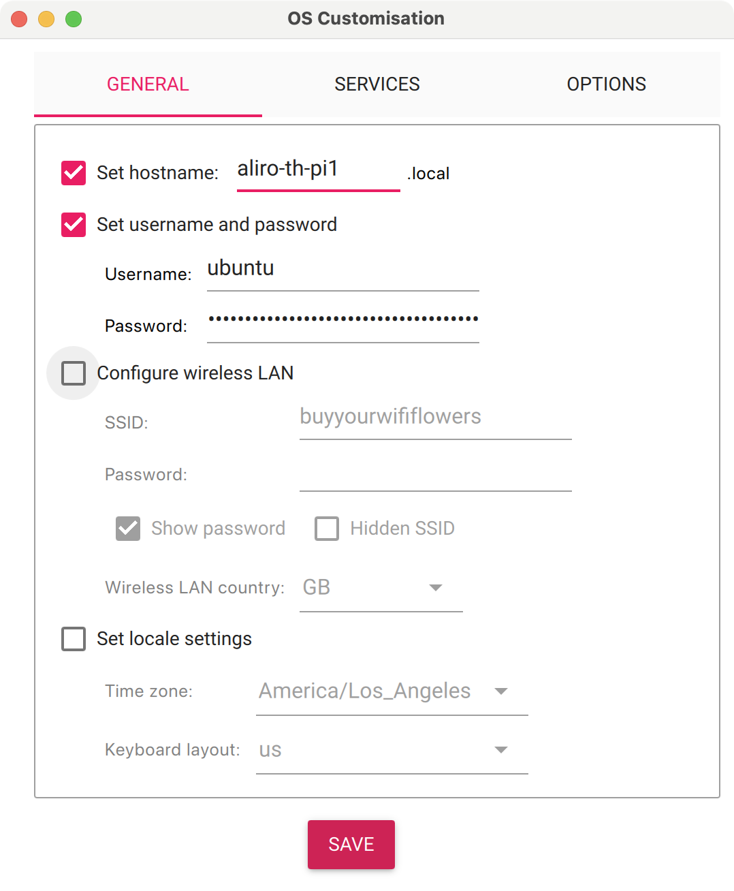

<!--
 *
 * Copyright (c) 2024-2026 Aliro Authors
 *
 * Licensed under the Apache License, Version 2.0 (the "License");
 * you may not use this file except in compliance with the License.
 * You may obtain a copy of the License at
 *
 * http://www.apache.org/licenses/LICENSE-2.0
 *
 * Unless required by applicable law or agreed to in writing, software
 * distributed under the License is distributed on an "AS IS" BASIS,
 * WITHOUT WARRANTIES OR CONDITIONS OF ANY KIND, either express or implied.
 * See the License for the specific language governing permissions and
 * limitations under the License.
-->

# Aliro Certification Tool — Setup Guide

Step-by-step instructions for taking a fresh Raspberry Pi from a blank SD card to a running Aliro Test Harness. Once the harness is up, switch to the [User Manual](USER_MANUAL.md) for day-to-day operation.

Setting up a fresh Test Harness takes about two hours, most of which is unattended download and install time.

## Table of Contents

- [1. Hardware Requirements](#1-hardware-requirements)
- [2. Software Requirements](#2-software-requirements)
- [3. Installing Ubuntu on SD Card](#3-installing-ubuntu-on-sd-card)
- [4. Assembling the Raspberry Pi](#4-assembling-the-raspberry-pi)
- [5. Connecting to the Raspberry Pi](#5-connecting-to-the-raspberry-pi)
- [6. Installing the Aliro Test Harness](#6-installing-the-aliro-test-harness)
- [7. Starting the Aliro Test Harness](#7-starting-the-aliro-test-harness)
- [8. Advanced Network Configuration](#8-advanced-network-configuration)
  - [8.1 Open Wi-Fi (no password) via netplan](#81-open-wi-fi-no-password-via-netplan)
  - [8.2 Link-local Address Support](#82-link-local-address-support)
- [9. Troubleshooting Setup](#9-troubleshooting-setup)

---

## 1. Hardware Requirements

**Host platform**

- Raspberry Pi 4 Model B — 8 GB RAM recommended; 4 GB may work.
- Power adapter rated for your Raspberry Pi.
- Micro SD card, 16 GB or larger.
- Computer with a micro-SD reader (or a micro-SD-to-USB adapter).
- Ethernet cable (optional but recommended for first-time setup).
- LAN or Wi-Fi network with internet access.

**NFC front end (Raspberry Pi HAT — sits on the 40-pin GPIO header)**

Pick one of:

- **NXP OM27160B1EVK** — PN7160 evaluation kit, SPI variant. Default. The Aliro setup script builds NXP `libnfc-nci` for SPI unless overridden.
- **NXP OM27160A1EVK** — PN7160 evaluation kit, I2C variant. Selected by running the setup with `NXP_TRANSPORT=I2C` (see [§7](#7-starting-the-aliro-test-harness)).

> [!NOTE]
> Both HATs connect to the Pi over the GPIO header; the only difference is which serial bus (SPI vs I2C) is used to talk to the PN7160. You only need one.

**BLE / UWB front end (USB-attached module)**

- **Murata LBUA0VG2BP-EVK-P** — BLE/UWB EVK, connects to the Raspberry Pi via micro-USB to USB-A (host-side). Only required if you intend to run the BLE/UWB transport suites; NFC-only setups can skip it.
- Micro-USB to USB-A cable, both ends male (connects the Murata module to one of the Pi's USB-A ports).

> [!TIP]
> The Test Harness can be configured entirely over SSH. If you would rather work directly on the Pi, you will also need a Micro-HDMI-to-HDMI cable, a monitor, and a USB keyboard.

## 2. Software Requirements

- Raspberry Pi Imager — https://www.raspberrypi.com/software/
- Ubuntu Server 22.04.x LTS (64-bit) — installed via Raspberry Pi Imager.
- A GitHub account with SSH access enabled (used to clone the tool).

> [!IMPORTANT]
> Before running BLE/UWB tests, update the firmware on the Murata board. Instructions: https://github.com/aliro-access-control/aliro-actuator/tree/release/aliro-sve-v1.0/third_party

## 3. Installing Ubuntu on SD Card

1. Download and run **Raspberry Pi Imager** on your computer.
2. Click **CHOOSE DEVICE** → "Raspberry Pi 4".
3. Click **CHOOSE OS** → "Other general-purpose OS" → "Ubuntu" → pick one of:
   - Ubuntu Server 22.04.3 LTS (64-bit)
   - Ubuntu Server 22.04.4 LTS (64-bit)
   - Ubuntu Server 22.04.5 LTS (64-bit)
4. Click **CHOOSE STORAGE** and select the micro SD card.
5. Click **NEXT**.

   

6. When prompted to apply OS customisation settings, click **EDIT SETTINGS**.
   - On the **GENERAL** tab:
     - Set a hostname that is unique per Test Harness (for example, `aliro-th-pi1`). The Pi will then be reachable on the LAN as `<hostname>.local`.
     - Set a username and password.
     - Optionally configure Wi-Fi (only password-protected networks are supported here; see [§8.1](#81-open-wi-fi-no-password-via-netplan) for open networks).
   - On the **SERVICES** tab:
     - Enable SSH and select **password authentication**.

   

7. Click **SAVE**, then **YES** to apply customisation.
8. Let Imager write and verify the SD card.

## 4. Assembling the Raspberry Pi

> [!TIP]
> Keep the Raspberry Pi disconnected from power while assembling.

1. Seat the OM27160B1EVK (SPI) or OM27160A1EVK (I2C) NFC HAT onto the Pi's 40-pin GPIO header. Make sure the connector is fully aligned before pressing down.
2. *(Optional)* Connect the Murata LBUA0VG2BP-EVK-P USB module to the Pi via the micro-USB cable (USB-A on the Pi side, micro-USB on the module).
   > **Note:** The Murata module is only required for BLE/UWB transport tests. NFC-only setups can skip it.
3. Insert the SD card.
4. *(Optional)* Attach an Ethernet cable.
5. *(Optional)* Connect a monitor and keyboard.
6. Power on the Pi.

## 5. Connecting to the Raspberry Pi

You can reach the Pi by mDNS hostname, by IP address, or directly via monitor and keyboard.

### Via SSH using hostname

> [!NOTE]
> mDNS hostname resolution does not work on every network. If this fails, fall back to the IP address method below.

Use the username and hostname you set during OS customisation:

```sh
ssh <username>@<hostname>.local
```

For example, `ssh ubuntu@aliro-th-pi1.local`. Enter the password set during OS customisation when prompted.

### Via SSH using IP address

```sh
ssh <username>@<ip-address>
```

For example, `ssh ubuntu@192.168.1.50`.

> [!TIP]
> If you do not know the Pi's IP, discover it from another machine on the LAN:
> - **Linux / macOS** (may require `net-tools`)
>   ```sh
>   arp -na | grep -i "b8:27:eb\|dc:a6:32\|e4:5f:01"
>   ```
> - **Windows**
>   ```cmd
>   arp -a | findstr b8-27-eb dc-a6-32 e4-5f-01
>   ```
> If your Pi uses a MAC prefix not listed, substitute the correct Raspberry Pi Foundation OUI.

### Via monitor and keyboard

A useful fallback for first-boot network configuration. Log in with the username and password you set during OS customisation.

## 6. Installing the Aliro Test Harness

1. Create an SSH key pair on the Pi to authenticate with GitHub:

   ```sh
   ssh-keygen -t ed25519 -C "<your-github-email>"
   ```

   > **Note:** Accept the default file location and leave the passphrase empty (press Enter twice).

2. Print the public key:

   ```sh
   cat ~/.ssh/id_ed25519.pub
   ```

3. Add the key to your GitHub account:
   - Open https://github.com/settings/ssh/new
   - Set a recognisable **Title** (for example, "aliro-th-pi1").
   - Paste the key into **Key**.
   - Click **Add SSH key**.

4. Clone the Aliro Certification Tool:

   ```sh
   cd ~
   git clone git@github.com:aliro-access-control/aliro-certification-tool.git
   ```

   When prompted about the host key, type `yes` and press Enter.

   > **Tip:** To pin to a specific release:
   > ```sh
   > cd ~/aliro-certification-tool
   > git checkout aliro-sve-v1.0
   > ```

5. Run the auto-installer:

   ```sh
   cd ~/aliro-certification-tool
   ./scripts/pi-setup/auto-install.sh
   ```

   - Enter your password when `[sudo]` prompts for it.
   - When asked *"The HEAD is detached from a branch. Should it checkout to develop before proceeding?"*, select **Yes**.
   - When the script finishes, type `1` and press Enter to reboot.

   > **Note:** The auto-installer is mostly hands-off but can take more than an hour depending on your internet speed. The first reboot after install can take five minutes or more while updates are applied.

## 7. Starting the Aliro Test Harness

1. Initialise the submodules:

   ```sh
   cd ~/aliro-certification-tool
   git submodule update --init --recursive
   ```

2. Run the setup script for your NFC variant.

   **SPI (default — OM27160B1EVK):**
   ```sh
   cd ~/aliro-certification-tool/test_collections/aliro
   ./setup.sh
   ```

   **I2C (OM27160A1EVK):**
   ```sh
   cd ~/aliro-certification-tool/test_collections/aliro
   NXP_TRANSPORT=I2C ./setup.sh
   ```

   Enter your password when `[sudo]` prompts for it. The script may take several minutes.

3. Start the Test Harness:

   ```sh
   cd ~/aliro-certification-tool
   ./scripts/start.sh
   ```

> [!NOTE]
> The Test Harness is configured to start automatically on boot from this point onward. See [USER_MANUAL.md §6.3](USER_MANUAL.md#63-disabling-autostart) to disable that behaviour.

The Test Harness is now running. Continue with [Using the Test Harness](USER_MANUAL.md#3-using-the-test-harness) in the User Manual to create a project and run your first test suite.

## 8. Advanced Network Configuration

### 8.1 Open Wi-Fi (no password) via netplan

Edit `/etc/netplan/50-cloud-init.yaml` on the Pi and add under `network:`:

```yaml
wifis:
    wlan0:
        dhcp4: true
        optional: true
        access-points:
            "<network_name>": {}
```

Apply the changes and reboot:

```sh
sudo netplan apply
sudo reboot
```

### 8.2 Link-local Address Support

Useful when you want to reach the Pi over a direct Ethernet cable without a DHCP server. Edit `/etc/netplan/50-cloud-init.yaml` and add under `network:`:

```yaml
ethernets:
    eth0:
        dhcp4: true
        optional: true
        link-local: [ ipv4, ipv6 ]
```

Apply:

```sh
sudo netplan try    # optional sanity check
sudo netplan apply
sudo reboot
```

## 9. Troubleshooting Setup

- **`Could not resolve hostname aliro-th-pi1.local`** — your network does not support mDNS. Use the IP address method in [§5](#5-connecting-to-the-raspberry-pi).
- **`Connection refused` over SSH** — give the Pi a minute or two after boot, then retry. If still failing, attach a monitor and keyboard and verify that `sshd` is running (`sudo systemctl status ssh`).
- **No IP on Wi-Fi** — confirm you selected a password-protected SSID during OS customisation. For open networks, see [§8.1](#81-open-wi-fi-no-password-via-netplan).

For issues with the Test Harness itself (service control, logs), see [USER_MANUAL.md §6 Troubleshooting](USER_MANUAL.md#6-troubleshooting).
