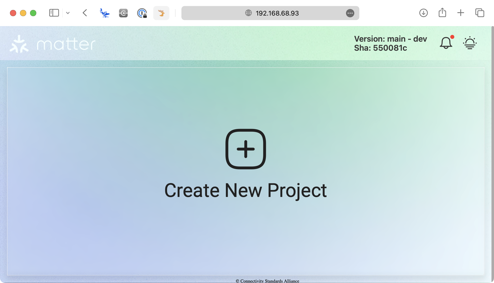
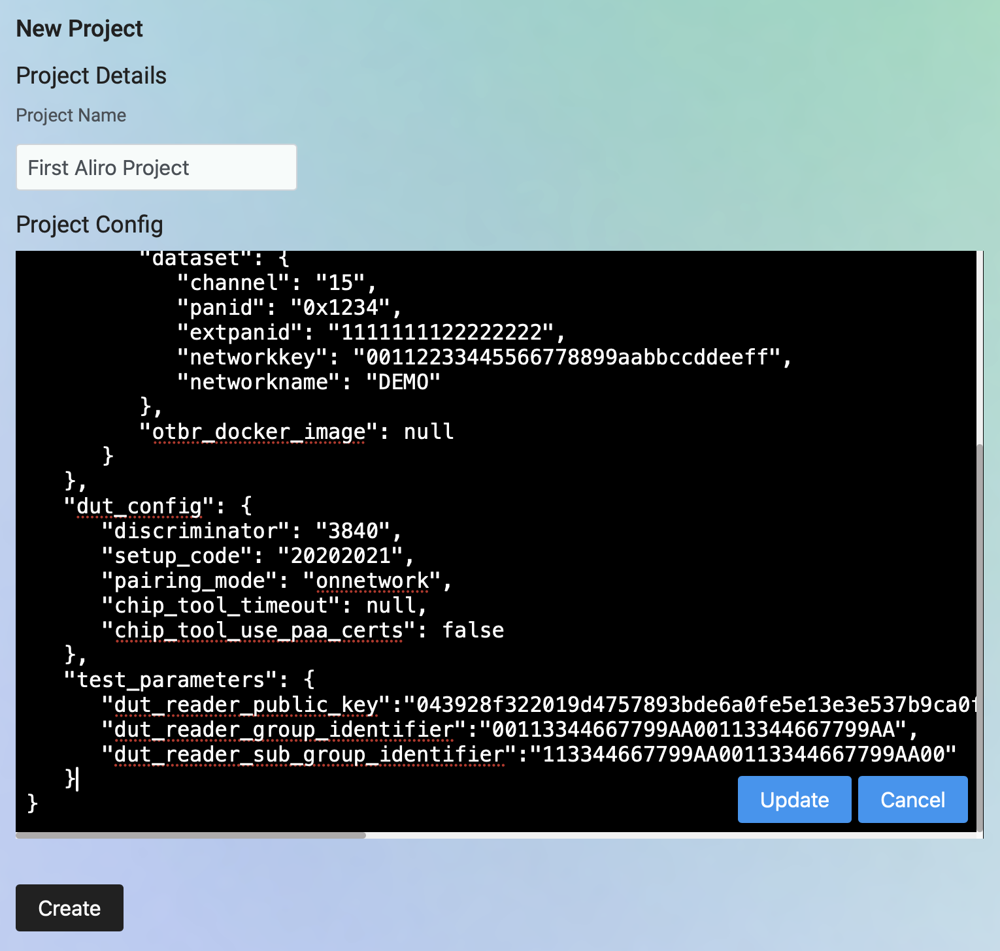

<!--
 *
 * Copyright (c) 2024-2026 Aliro Authors
 *
 * Licensed under the Apache License, Version 2.0 (the "License");
 * you may not use this file except in compliance with the License.
 * You may obtain a copy of the License at
 *
 * http://www.apache.org/licenses/LICENSE-2.0
 *
 * Unless required by applicable law or agreed to in writing, software
 * distributed under the License is distributed on an "AS IS" BASIS,
 * WITHOUT WARRANTIES OR CONDITIONS OF ANY KIND, either express or implied.
 * See the License for the specific language governing permissions and
 * limitations under the License.
-->

# Aliro Certification Tool — User Manual

A Test Harness and tooling designed to simplify development, testing, and certification of Aliro devices, guided by the Connectivity Standards Alliance Aliro Working Group.

## Version Matrix

| Component                  | Version                              |
| -------------------------- | ------------------------------------ |
| Tool release tag           | `aliro-sve-v1.0`                     |
| Aliro Specification        | 1.0                                  |
| Aliro CSG TT Test Plan     | 1.0 (for Aliro 1.0)                  |
| Ubuntu Server (TH host)    | 22.04.3 / 22.04.4 / 22.04.5 LTS (64-bit) |
| Raspberry Pi               | 4 Model B (8 GB recommended, 4 GB minimum) |
| Supported NFC HAT          | NXP OM27160B1EVK (SPI) / OM27160A1EVK (I2C) — Raspberry Pi GPIO HAT |
| Supported BLE/UWB module   | Murata LBUA0VG2BP-EVK-P — USB-attached      |

## Revision History

| Revision | Date       | Author       | Description                                                        |
| -------- | ---------- | ------------ | ------------------------------------------------------------------ |
| 1.0      | 2026-05-14 | Aliro WG     | Initial restructured user manual split out of the project README. |

## Table of Contents

- [1. Introduction](#1-introduction)
- [2. References](#2-references)
  - [2.1 Specifications and Working Group](#21-specifications-and-working-group)
  - [2.2 Project Repositories](#22-project-repositories)
  - [2.3 NXP NFC Front End (PN7160)](#23-nxp-nfc-front-end-pn7160)
  - [2.4 Murata BLE/UWB Front End (LBUA0VG2BP-EVK-P)](#24-murata-bleuwb-front-end-lbua0vg2bp-evk-p)
  - [2.5 Operating System and Imaging](#25-operating-system-and-imaging)
- [3. Using the Test Harness](#3-using-the-test-harness)
  - [3.1 Opening the GUI](#31-opening-the-gui)
  - [3.2 Configuring a Test Project](#32-configuring-a-test-project)
  - [3.3 Creating and Running a Test Run](#33-creating-and-running-a-test-run)
- [4. Test Parameters](#4-test-parameters)
  - [4.1 Parameters for Reader Tests](#41-parameters-for-reader-tests)
  - [4.2 Parameters for User Device Tests](#42-parameters-for-user-device-tests)
- [5. Updating the Tool](#5-updating-the-tool)
- [6. Troubleshooting](#6-troubleshooting)
  - [6.1 Test Harness Service](#61-test-harness-service)
  - [6.2 Inspecting Logs](#62-inspecting-logs)
  - [6.3 Disabling Autostart](#63-disabling-autostart)
- [7. Authoring Test Scripts](#7-authoring-test-scripts)
- [8. Step-up Phase Provisioning](#8-step-up-phase-provisioning)
- [9. License](#9-license)

---

## 1. Introduction

The Aliro Certification Tool (also called the Test Harness, or **TH**) is the official test setup for verifying that a device under test (DUT) implements the Aliro digital-key specification correctly. It exercises the Aliro protocol over its supported transports — NFC, BLE, and BLE/UWB — and produces pass/fail results suitable for certification submission.

The tool is built on top of the CSA Matter Test Harness. The frontend, backend, database, and reverse-proxy stack are reused, while the Aliro-specific test cases and hardware actuation live in `test_collections/aliro/`. Because the upstream UI labels are still under migration, you may see Matter-flavored copy in some screens; this is expected and being addressed incrementally.

This manual covers day-to-day operation of an installed Test Harness: running tests through the GUI, configuring test parameters, updating the tool, and troubleshooting.

> [!NOTE]
> Setting up a new Test Harness from scratch? Start with [SETUP.md](SETUP.md), which walks from a blank SD card to a running harness. For a description of the test harness internals, see [ARCHITECTURE.md](ARCHITECTURE.md).

## 2. References

### 2.1 Specifications and Working Group

| Reference                            | Link                                                             |
| ------------------------------------ | ---------------------------------------------------------------- |
| Connectivity Standards Alliance      | https://csa-iot.org                                              |
| Aliro Working Group (members-only)   | https://groups.csa-iot.org/wg/aliro-wg                           |

### 2.2 Project Repositories

| Reference                            | Link                                                             |
| ------------------------------------ | ---------------------------------------------------------------- |
| Aliro Certification Tool (this repo) | https://github.com/aliro-access-control/aliro-certification-tool |
| Aliro Actuator (firmware-side)       | https://github.com/aliro-access-control/aliro-actuator           |
| CSA Matter Test Harness (upstream)   | https://github.com/project-chip/certification-tool               |
| Contribution guide                   | [CONTRIBUTION.md](../CONTRIBUTION.md)                               |

### 2.3 NXP NFC Front End (PN7160)

| Reference                                            | Link                                                            |
| ---------------------------------------------------- | --------------------------------------------------------------- |
| AN12991 — PN7160 Linux software stack overview       | https://www.nxp.com/docs/en/application-note/AN12991.pdf        |
| AN13287 — PN7160 antenna design and configuration    | https://www.nxp.com/docs/en/application-note/AN13287.pdf        |
| NXPNFCLinux/linux_libnfc-nci (`NCI2.0_PN7160`)        | https://github.com/NXPNFCLinux/linux_libnfc-nci                 |

### 2.4 Murata BLE/UWB Front End (LBUA0VG2BP-EVK-P)

| Reference                                            | Link                                                                                           |
| ---------------------------------------------------- | ---------------------------------------------------------------------------------------------- |
| Murata EVK firmware update and flashing instructions | https://github.com/aliro-access-control/aliro-actuator/tree/release/aliro-sve-v1.0/third_party |

### 2.5 Operating System and Imaging

| Reference                            | Link                                                             |
| ------------------------------------ | ---------------------------------------------------------------- |
| Raspberry Pi Imager                  | https://www.raspberrypi.com/software/                            |
| Ubuntu Server downloads              | https://ubuntu.com/download/server                               |

## 3. Using the Test Harness

This section assumes a set-up, running Test Harness. If you are starting from scratch, follow [SETUP.md](SETUP.md) first.

### 3.1 Opening the GUI

Browse to the Pi's IP address from any computer on the same LAN:

```
http://<raspberry-pi-ip-address>
```

For example, `http://192.168.2.9`.



> [!TIP]
> Find the Pi's IP with `hostname -I` from a shell on the Pi.

> [!TIP]
> Give the Pi a couple of minutes to finish booting before connecting.

### 3.2 Configuring a Test Project

1. Click **Create Project**.
2. Give the project a name.
3. Configure the test parameters:
   - In **Project Config**, click **Edit**.
   - In the JSON, find `test_parameters` (preloaded with default values).
   - Replace the defaults with values that match your DUT. Example:

     ```json
     "test_parameters": {
         "dut_reader_public_key": "043928f322019d4757893bde6a0fe5e13e3e537b9ca0f549c0bd2f40f79060252a0a4f291192157a95cb6eb202759428c00cd834998c5d0eab192ee8873c5d34ee",
         "dut_reader_group_identifier": "00113344667799AA00113344667799AA",
         "dut_reader_issuer_group_identifier": "00113344667799AA00113344667799AB",
         "dut_reader_group_sub_identifier": "113344667799AA00113344667799AA00",
         "dut_reader_group_resolving_key": "00000000000000000000000000000000"
     }
     ```

     A full reference is in [§4 Test Parameters](#4-test-parameters).

     

4. Click **Update** to save, then **Create** to finish creating the project.

> [!TIP]
> You can edit parameters on an existing project later by clicking the pencil icon on its row.

### 3.3 Creating and Running a Test Run

1. Click the ▶️ ("Go To Test-Run") button next to the project.

   

2. Click **Create new Test Run**.

   

3. Select an **Operator Name** in the top-right corner (create one on first use).
4. Select the test suite or individual test cases to run. Multiple cases can be selected.

   > **Note:** Test suites are grouped by transport type (NFC, BLE/UWB) and device role (Reader, User Device). To exercise a Reader over BLE/UWB, choose the "BLE Reader" suite.

   > **Tip:** Test selection can also be driven by PICS. Each test case declares the PICS items it requires — device role (`RD`/`UD`), transport (`NFC`, `BLEUWB`, `BLERKE`), and individual test-case identifiers — and importing your DUT's PICS into the project selects the applicable test cases automatically, based on the features the DUT supports.

5. Click **Start**.

   

## 4. Test Parameters

Parameters are set per project. All HEX values are case-insensitive. Where a key supports PEM format, use a literal `\n` for line breaks inside the JSON string.

The tables below cover the full parameter set. The defaults preloaded by the Project Config editor live in [`test_collections/aliro/default_project.config`](../test_collections/aliro/default_project.config).

### 4.1 Parameters for Reader Tests

| Key                                   | Description                                                                       | Format(s)                          |
| ------------------------------------- | --------------------------------------------------------------------------------- | ---------------------------------- |
| `dut_reader_public_key`               | Public key of the Reader DUT.                                                     | DER-HEX or PEM string              |
| `dut_reader_group_identifier`         | Group identifier for the Reader DUT.                                              | HEX string                         |
| `dut_reader_issuer_group_identifier`  | Group identifier for the Reader Issuer CA certificate.                            | HEX string                         |
| `dut_reader_group_sub_identifier`     | Sub-group identifier for the Reader DUT.                                          | HEX string                         |
| `dut_reader_group_resolving_key`      | Group resolving key, used for BLE tests during dynamic tag generation.            | HEX string                         |
| `th_access_credential_private_key`    | Private key for the user access credential simulated by the tool.                 | DER-HEX or PEM string              |
| `th_access_credential_public_key`     | Public key for the user access credential simulated by the tool.                  | DER-HEX or PEM string              |
| `dut_reader_issuer_public_key`        | Reader System Issuer CA certificate public key, used for certificate verification.| DER-HEX or PEM string              |
| `th_credential_issuer_private_key`    | Private key of the credential issuer simulated by the tool.                       | DER-HEX or PEM string              |
| `th_credential_issuer_public_key`     | Public key of the credential issuer simulated by the tool.                        | DER-HEX or PEM string              |
| `th_credential_issuer_ca_private_key` | Private key of the CA for the credential issuer simulated by the tool.            | DER-HEX or PEM string              |
| `th_credential_issuer_ca_public_key`  | Public key of the CA for the credential issuer simulated by the tool.             | DER-HEX or PEM string              |
| `dut_access_element_id`               | Access element identifier used in Access Documents for Step-up tests (default `floor1`). | String                      |

### 4.2 Parameters for User Device Tests

> [!NOTE]
> Private and public keys must match. Either set both or set neither.

| Key                              | Description                                                                                        | Format(s)                                |
| -------------------------------- | -------------------------------------------------------------------------------------------------- | ---------------------------------------- |
| `th_reader_private_key`          | Private key for the Reader simulated by the tool.                                                  | DER-HEX (138 or 32 bytes) or PEM string  |
| `th_reader_public_key`           | Public key for the Reader simulated by the tool.                                                   | DER-HEX or PEM string                    |
| `th_reader_group_identifier`     | Group identifier for the simulated Reader.                                                         | HEX string                               |
| `th_reader_sub_group_identifier` | Sub-group identifier for the simulated Reader.                                                     | HEX string                               |
| `th_reader_certificate`          | Reader certificate sent during `LOAD_CERT` and `AUTH1` commands.                                   | HEX string                               |
| `th_reader_certificate_chaining` | Reader certificate with a chained issuer, used by the certificate-chaining test cases.             | HEX string                               |
| `th_reader_group_resolving_key`  | Group resolving key, used for BLE tests during dynamic tag generation.                             | HEX string                               |
| `th_reader_spsm`                 | SPSM (Simplified Protocol / Service Multiplexer) for the BLE Reader Protocol Version Characteristic.| HEX string                               |
| `th_access_credential_public_key`| Access credential public key for the tool's key-slot lookup table.                                 | DER-HEX or PEM string                    |
| `th_reader_issuer_public_key`    | Reader System Issuer CA certificate public key, used for key generation with certificates.        | DER-HEX or PEM string                    |
| `dut_credential_issuer_public_key`| Public key of the credential issuer for the User Device DUT.                                      | DER-HEX or PEM string                    |
| `th_access_element_id`           | Access element identifier used by the simulated Reader in Access Documents for Step-up tests (default `floor1`). | String                    |

## 5. Updating the Tool

To move the Pi to a newer Aliro Certification Tool release:

1. Check out the target tag (for example, `aliro-sve-v1.0`):

   ```sh
   cd ~/aliro-certification-tool
   git fetch
   git checkout aliro-sve-v1.0
   ```

2. Run the update script:

   ```sh
   ./scripts/update.sh
   ```

## 6. Troubleshooting

> [!TIP]
> For problems during first-time setup — SSH, hostname resolution, Wi-Fi — see [SETUP.md §9 Troubleshooting Setup](SETUP.md#9-troubleshooting-setup).

### 6.1 Test Harness Service

The Test Harness starts automatically on boot. To control it manually, run these commands from inside `~/aliro-certification-tool`:

```sh
# Stop
./scripts/stop.sh

# Start
./scripts/start.sh
```

### 6.2 Inspecting Logs

To stream the full Docker Compose log:

```sh
cd ~/aliro-certification-tool
docker compose logs
```

To follow only the backend (useful when iterating on test scripts):

```sh
docker compose logs -f backend
```

### 6.3 Disabling Autostart

```sh
sudo systemctl disable aliro-th
```

Re-enable with `sudo systemctl enable aliro-th`.

## 7. Authoring Test Scripts

If you would like to contribute to the Aliro Test Harness, follow the workflow in [CONTRIBUTION.md](../CONTRIBUTION.md). For the design context behind the layered structure of the actuator, see [ARCHITECTURE.md](ARCHITECTURE.md).

Aliro test scripts live in `test_collections/aliro/`. After changing or adding a test script, restart the backend so the new code is picked up:

```sh
docker restart aliro-certification-tool-backend-1
```

Stream backend logs as you iterate:

```sh
docker compose logs -f backend
```

## 8. Step-up Phase Provisioning

The Step-up phase involves three components:

- **Access Document** — provisioned onto the DUT ahead of time.
- **Device Request** — sent by the Reader during the transaction.
- **Device Response** — built by the User Device from the Access Document, in response to the Device Request.

Before a setup can be validated against the Step-up phase, the correct Access Document must be present on the DUT. A provisioning helper script is included:

```
test_collections/aliro/support/access_doc/step-up/step_up_provision.py
```

Run it on the Test Harness host. The script generates the test components and loads the Access Document onto the DUT.

> [!NOTE]
> You may need to install missing Python packages (`pip install <package>`) before the script runs successfully.

## 9. License

Released under the [Apache 2.0 License](../LICENSE).
